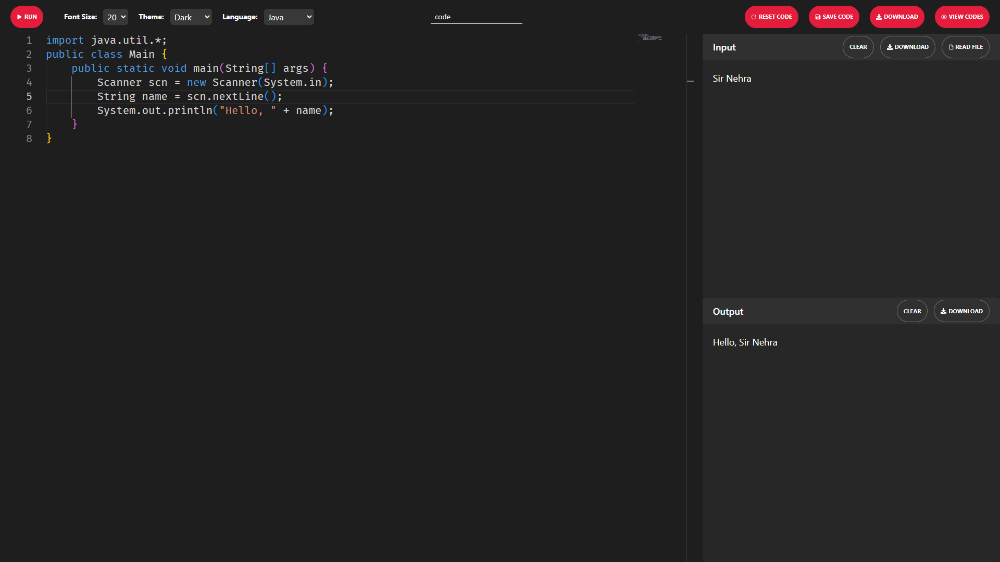

# Code Compiler App 🚀

[Deployment URL](https://online-compiler-app-frontend.onrender.com/)]

**Note:** Please be aware of the following:

1. **Java Compatibility:** Java Programs may not work on the LIVE Website since it's hosted on the free tier of Render, which does not allow the installation of Java. However, the good news is that it should work perfectly when run locally on your system.

2. **Initial Loading Time:** Please be patient during the initial loading of the application. Due to the limitations of the free tier, the service may spin down after 15 minutes of inactivity. As a result, the first request after the service is spun down might take around 30 seconds to complete. Subsequent requests should be significantly faster.


A powerful and user-friendly online code compiler that allows you to write, compile, and run code in various programming languages directly within your web browser.



## Table of Contents

- [Introduction](#introduction)
- [Features](#features)
- [Getting Started](#getting-started)
- [Usage](#usage)
- [Customization](#customization)
- [Built-in Code Library](#built-in-code-library)
- [Save Your Code](#save-your-code)
- [Download Code and Output](#download-code-and-output)
- [Contributing](#contributing)

## Introduction 📚

The Code Compiler App simplifies the process of coding, compiling, and testing your programs. Whether you're a student, developer, or coding enthusiast, this app offers a seamless way to write and run code without the need for complex setups.

## Features 🌟

- **Multi-language Support:** Compile and run code in languages such as C, C++, Python, Java, and JavaScript.
- **Real-time Output:** See instant feedback on your code's output.
- **User-Friendly Interface:** An intuitive code editor and output console.
- **Customizable Themes:** Choose from different themes (Dark, Light, and High-Contrast Black) to suit your coding environment.
- **Adjustable Font Size:** Customize the editor's font size for better readability.
- **Built-in Code Library:** Get a head start with prewritten code templates for various programming languages when you select a language.
- **Rename Code:** Give your code a unique name for easy management.
- **Reset Code:** Quickly reset your code to its initial state.
- **Clear Input/Output:** Clear input and output with a single click.
- **Download Input:** Download your input data as a text file for documentation.
- **Load Input from Other Files:** Easily load input from external text files.
- **Save and Manage Your Code:** Save your code snippets, manage them, and reuse them later.
- **Download Code and Output:** Download your code and the corresponding output.

## Getting Started 🚀

### Prerequisites

Before using the Code Compiler App, ensure you have the following prerequisites:

- Node.js
- npm or yarn

### Installation

1. Clone this repository to your local machine.
2. Install project dependencies using npm or yarn (for both frontend and backend):

   ```
   npm install
   # or
   yarn install
   ```
3. Start the development server (both frontend and backend):

   ```
   npm run dev
   # or
   yarn run dev
   ```
4. Open your web browser and access the app at `http://localhost:3000` (by default).

## Usage 🖋️

Using the Code Compiler App is straightforward:

1. Choose your desired programming language from the dropdown menu.
2. Write or paste your code in the editor on the left.
3. Add inputs on the right (if any).
4. Optionally, adjust the font size, theme, and other preferences.
5. Click the "Run" button to compile and execute your code.
6. View the real-time output in the console on the right.

### Usage Example


## Customization 🎨

### Font Size

You can customize the font size of the code editor for better readability. Simply select the desired font size from the dropdown menu.

### Themes

The app offers multiple themes for the code editor, including Dark, Light, and High-Contrast Black. Choose the theme that suits your coding preferences.

### Built-in Code Library

Access the built-in code library to quickly load default code snippets for various programming languages. Select a language and it automatically loads with the default code.

## Save Your Code 💾

Easily save your code snippets for future use:

1. Enter a name for your code in the provided input field.
2. Click the "Save Code" button to save your code locally.
3. Manage and view your saved code snippets in the "View Codes" section.

## Download Code and Output 📥

Download your code and output for further analysis or sharing:

- Use the "Download" button to save your code as a text file with the appropriate file extension.
- Download the input and output as separate text files for documentation purposes.

## Contributing 🤝

I welcome contributions from the community! If you'd like to contribute to the Code Compiler App, please follow these steps:

1. Fork this repository.
2. Create a new branch for your feature or bug fix.
3. Make your changes and test thoroughly.
4. Submit a pull request with a clear description of your changes.

I hope you enjoy using the Code Compiler App! It provides a hassle-free environment for coding and testing your programs. If you encounter any issues or have feedback, please let us know.
